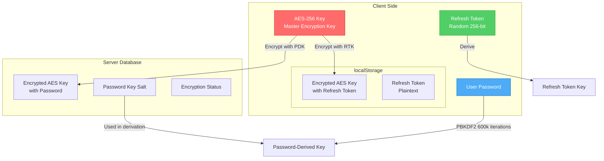
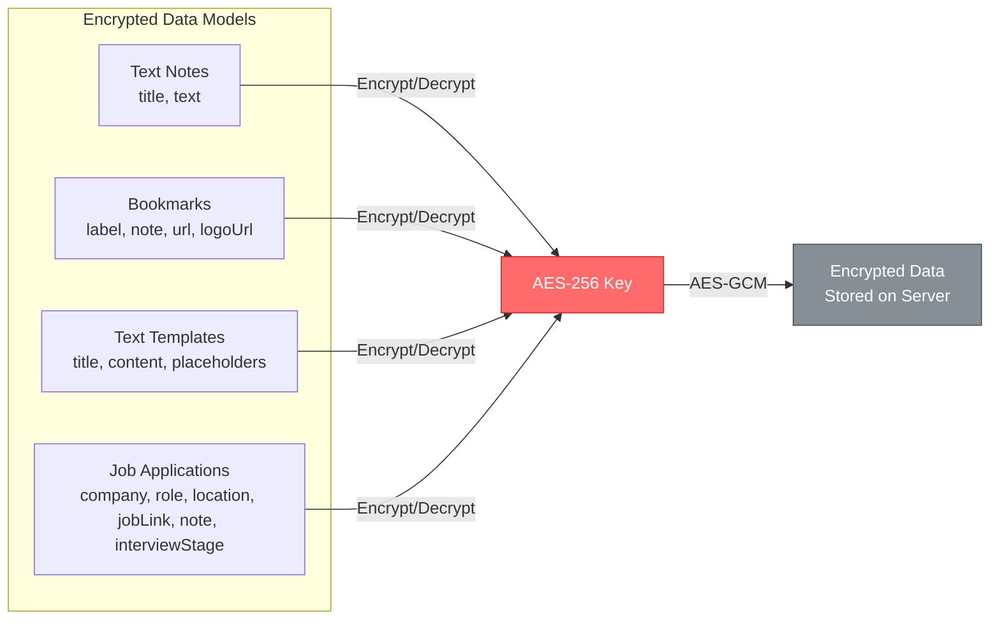
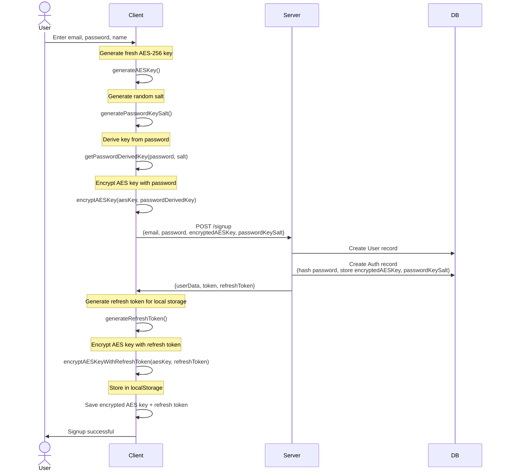
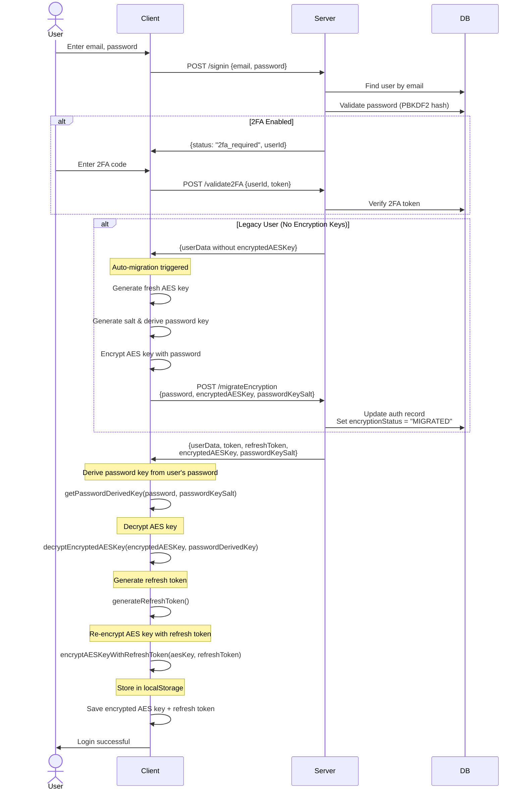
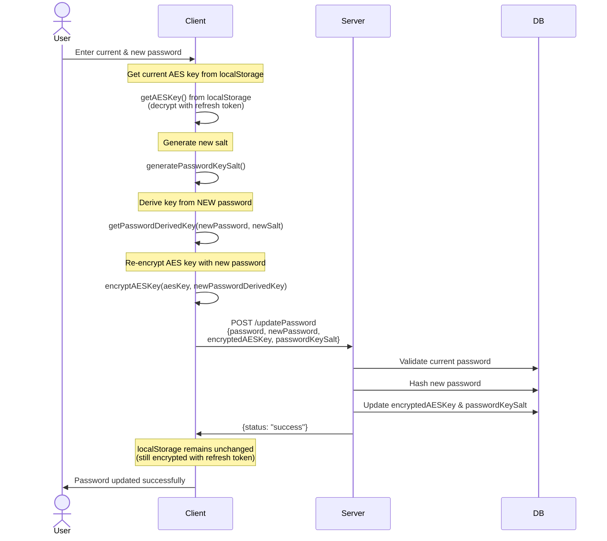
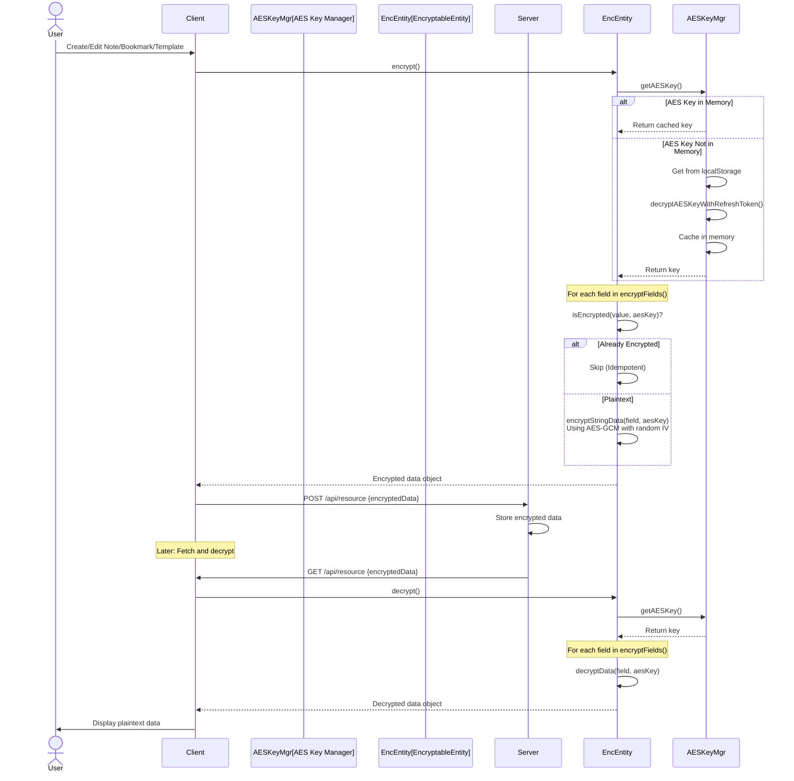
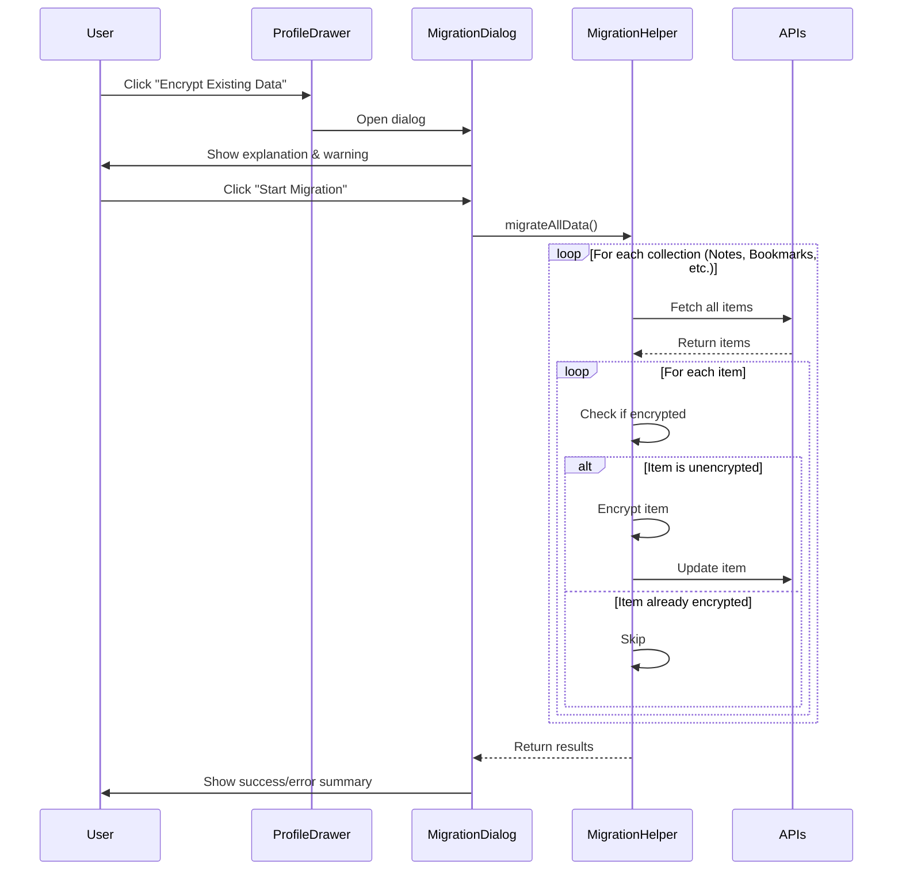

# End-to-End Encryption (E2E) in Mellow Tools

## Overview

Mellow Tools implements **client-side End-to-End Encryption** to ensure that sensitive user data (notes, bookmarks, text templates) is encrypted on the client before being sent to the server. The server stores only encrypted data and cannot decrypt it.

## Key Concepts

### Encryption Keys

The system uses multiple layers of encryption keys:

1. **AES-256 Key** (Master Data Encryption Key)
   - A randomly generated 256-bit AES key
   - Used to encrypt/decrypt all user data (notes, bookmarks, templates)
   - Generated once during signup and never changes
   - Never stored in plaintext anywhere

2. **Password-Derived Key** (PDK)
   - Derived from user's password using PBKDF2 with 600,000 iterations
   - Uses a unique salt (`passwordKeySalt`) stored in the database
   - Used to encrypt the AES key for storage on the server
   - Changes when user updates their password

3. **Refresh Token Key** (RTK)
   - A randomly generated 256-bit key stored in browser localStorage
   - Used to encrypt the AES key for local storage
   - Allows the app to decrypt data without re-entering password on each page load
   - Cleared on logout

### Encryption Status

The `encryptionStatus` field in the `auth` model tracks the encryption state:

- **`UNENCRYPTED`**: Legacy users who signed up before E2E encryption was implemented
- **`MIGRATED`**: Users who were migrated from unencrypted to encrypted state (via auto-migration on login)
- **`ENCRYPTED`**: New users who signed up with E2E encryption enabled

---

## Architecture Diagrams

### Key Storage Architecture



### Data Encryption Flow



---

## Detailed Flows

### 1. Signup Flow



**Key Points:**

- AES key is generated on the client and never sent in plaintext
- Server stores the AES key encrypted with the password-derived key
- Client stores the AES key encrypted with a refresh token for session persistence

---

### 2. Login Flow



**Key Points:**

- Password is used to decrypt the AES key from the server
- AES key is then re-encrypted with a refresh token for local storage
- Legacy users are automatically migrated on first login (**Password Required for Verification**)
- 2FA validation happens before encryption keys are returned

---

### 3. Password Update Flow



**Key Points:**

- The AES key itself never changes, only its encryption wrapper
- Server-side encrypted copy is updated with new password-derived key
- Client-side localStorage copy remains unchanged (uses refresh token, not password)
- User can continue using the app without re-login

---

### 4. Data Encryption/Decryption Flow



**Key Points:**

- `EncryptableEntity` implements a **re-encryption guard** to prevent double-encryption.
- Encryption process is **idempotent**: running it on an already-encrypted item will not change its content.
- AES-GCM mode is used with a random 12-byte IV for each encryption operation.
- AES key is cached in memory for performance.
- Decryption gracefully handles legacy plaintext data (returns as-is if decryption fails).

---

## Encrypted Data Models

### Client-Side Models

All models extend `EncryptableEntity` and define which fields are encrypted:

| Model | Encrypted Fields |
|-------|-----------------|
| **TextNote** | `title`, `text` |
| **Bookmark** | `label`, `note`, `url`, `logoUrl` |
| **TextTemplate** | `title`, `content`, `placeholders` |
| **JobApplication** | `company`, `role`, `location`, `jobLink`, `note`, `interviewStage` |

> [!NOTE]
> Fields like `status`, `appliedOn`, and `nextInterviewDate` are intentionally left unencrypted as they are used for filtering and sorting operations.

---

## Key Storage Locations

### Server (Database - `auth` collection)

```javascript
{
  user: ObjectId,                    // Reference to user
  password: String,                  // Hashed with PBKDF2 (1000 iterations, SHA-512)
  salt: String,                      // Salt for password hash
  passwordKeySalt: String,           // Salt for password-derived encryption key
  encryptedAESKey: String,           // AES key encrypted with password-derived key
  encryptionStatus: String,          // "UNENCRYPTED" | "MIGRATED" | "ENCRYPTED"
  twoFactorSecret: String,           // TOTP secret (if 2FA enabled)
  isTwoFactorEnabled: Boolean        // 2FA status
}
```

### Client (localStorage)

```javascript
{
  "actkn": "JWT_TOKEN",                                    // JWT access token
  "refreshToken": "REFRESH_TOKEN",                         // JWT refresh token
  "aesRefreshToken": "RANDOM_256_BIT_TOKEN",              // Refresh token for AES key
  "encryptedAESKeyWithRefreshToken": "ENCRYPTED_AES_KEY", // AES key encrypted with refresh token
  "user": {                                                // User info (plaintext)
    "displayName": "...",
    "email": "...",
    "userId": "..."
  }
}
```

### Client (Memory - `AESKeyManager`)

```javascript
{
  aesKey: CryptoKey | undefined  // Cached AES key (cleared on logout)
}
```

---

## Cryptographic Specifications

### Algorithms Used

| Purpose | Algorithm | Parameters |
|---------|-----------|------------|
| **Password Hashing** (Server) | PBKDF2 | 1,000 iterations, SHA-512, 64-byte output |
| **Password Key Derivation** (Client) | PBKDF2 | 600,000 iterations, SHA-256, 256-bit output |
| **Data Encryption** | AES-GCM | 256-bit key, 12-byte IV (random per encryption) |
| **Key Wrapping** | AES-GCM | 256-bit key, 12-byte IV (random per encryption) |

> [!WARNING]
> **Security Concern**: The server uses PBKDF2 with only **1,000 iterations** for password hashing, which is significantly below modern recommendations (OWASP recommends 600,000+ for PBKDF2-SHA-512). This makes the server-side password hashes vulnerable to brute-force attacks if the database is compromised.

### Encryption Format

All encrypted data follows this format:

```
[12-byte IV][Encrypted Data][16-byte Auth Tag]
```

- Encoded as Base64 for storage/transmission
- IV is randomly generated for each encryption operation
- Auth tag is automatically generated by AES-GCM

---

## Security Analysis

### ✅ Strengths

1. **True E2E Encryption**: Server never sees plaintext data or unencrypted AES keys
2. **Mandatory Password Verification**: API calls to update encryption keys require the account password, verified against the hashed password on the server.
3. **Double-Encryption Protection**: Core models and migration helpers check for existing encryption before applying new encryption.
4. **Strong Client-Side KDF**: 600,000 PBKDF2 iterations protects against offline attacks on client
5. **Authenticated Encryption**: AES-GCM provides both confidentiality and integrity
6. **Random IVs**: Each encryption uses a fresh random IV
7. **Key Separation**: Different keys for server storage (password) vs. client storage (refresh token)
8. **Automatic Migration**: Legacy users are seamlessly migrated to encryption

### ⚠️ Concerns & Recommendations

#### 1. **Weak Server-Side Password Hashing** (High Priority)

**Issue**: Server uses PBKDF2 with only 1,000 iterations (vs. 600,000 on client).

**Risk**: If database is compromised, passwords can be brute-forced relatively easily.

**Recommendation**: Increase to at least 600,000 iterations or migrate to Argon2id.

**Location**: [`server/src/models/auth.model.js:51-57`](file:///Users/mellow/Documents/Github/Mellow-Tools/server/src/models/auth.model.js#L51-L57)

---

#### 2. **No Key Rotation Mechanism** (Low Priority)

**Issue**: AES keys are generated once and never rotated.

**Risk**: Long-term key exposure if client is compromised.

**Recommendation**: Consider implementing periodic key rotation (e.g., annually) with re-encryption of all user data.

---

#### 3. **Refresh Token Stored in Plaintext** (Low Priority)

**Issue**: The `aesRefreshToken` is stored in plaintext in localStorage.

**Location**: [`client/src/helper/localStorage.helper.ts`](file:///Users/mellow/Documents/Github/Mellow-Tools/client/src/helper/localStorage.helper.ts)

**Risk**: If an attacker gains XSS access, they can steal the refresh token and decrypt the AES key from localStorage.

**Mitigation**: This is an inherent limitation of web-based E2E encryption. Ensure strong Content Security Policy (CSP) and XSS protection.

---

## Migration Strategy

The application uses a multi-layered migration approach to ensure all users are transitioned to E2E encryption securely and seamlessly.

### 1. Auto-Migration on Login
When a user without encryption keys logs in, the system automatically:
1. **Generates AES Key** (client-side)
2. **Derives Password Key** from user's password
3. **Encrypts AES Key** with password key
4. **Stores Keys** in database (`encryptedAESKey`, `passwordKeySalt`) via `POST /migrateEncryption`.
5. **Backend Verification**: The server verifies the password before permitting the key save.

**Location**: [`client/src/pages/auth/LoginForm.tsx:156-198`](file:///Users/mellow/Documents/Github/Mellow-Tools/client/src/pages/auth/LoginForm.tsx#L156-L198)

### 2. Mandatory Migration Dialog (For Active Sessions)
If a user is already logged in when the E2E update is released, or if they somehow bypass the login migration:
- A global, non-dismissible `AccountMigrationDialog` appears.
- It prompts the user for their password to set up their encryption keys.
- Completion follows the same backend-verified path as the login migration.

**Location**: [`client/src/components/AccountMigrationDialog.tsx`](file:///Users/mellow/Documents/Github/Mellow-Tools/client/src/components/AccountMigrationDialog.tsx)

### 3. Manual Data Encryption
Creating keys does not automatically encrypt old data. Users must manually trigger the bulk encryption:
1. **Navigate** to Profile Drawer -> "Encrypt Existing Data 🔐".
2. **System**:
   - Fetches all user data (notes, bookmarks, templates, job applications).
   - Uses **Recursive Detection**: Correctly identifies encryption within complex objects or arrays (e.g., Text Template placeholders) by attempting decryption on all leaf nodes.
   - **Safety Shield**: The core `EncryptableEntity` and `isFieldEncrypted` helper skip items that are already secure, preventing data loss from double-encryption.
   - Updates items on server in batches.

**Locations**:
- Migration Helper: [`client/src/helper/dataMigration.helper.ts`](file:///Users/mellow/Documents/Github/Mellow-Tools/client/src/helper/dataMigration.helper.ts)
- Migration Dialog: [`client/src/components/DataMigrationDialog.tsx`](file:///Users/mellow/Documents/Github/Mellow-Tools/client/src/components/DataMigrationDialog.tsx)
- Profile Drawer: [`client/src/components/ProfileDrawer.tsx`](file:///Users/mellow/Documents/Github/Mellow-Tools/client/src/components/ProfileDrawer.tsx)

#### Migration Flow



#### Detection Logic

The system detects unencrypted data by attempting decryption recursively. If a field contains an array or object, it checks each element.

```typescript
// Recursive decryption check
static async isFieldEncrypted(value, aesKey) {
  // Handle null/undefined (considered "secure" for migration)
  if (value === undefined || value === null) return true;

  // Handle recursive structures (Arrays)
  if (Array.isArray(value)) {
    if (value.length === 0) return true;
    for (const item of value) {
      if (!(await this.isFieldEncrypted(item, aesKey))) return false;
    }
    return true;
  }

  // Handle recursive structures (Objects)
  if (typeof value === "object" && value !== null) {
      const keys = Object.keys(value);
      if (keys.length === 0) return true;
      for (const key of keys) {
          if (!(await this.isFieldEncrypted(value[key], aesKey))) return false;
      }
      return true;
  }

  // Handle non-string primitives (not encryption targets)
  if (typeof value !== "string") return true;

  // Optimization: Very short strings (<20 chars) are likely not encrypted
  if (value.length < 20) return false;

  // Attempt decryption
  return await Encryption.isEncrypted(value, aesKey);
}
```

**Characteristics**:
- ✅ **Non-destructive**: Preserves already-encrypted data.
- ✅ **Idempotent**: Safe to run multiple times.
- ✅ **Secure**: Guarded by mandatory password verification.
- ✅ **Detailed**: Tracks successes, failures, and existing encrypted items per collection.

---

## Code References

### Client-Side

| File | Purpose |
|------|---------|
| [`encryption.helper.ts`](file:///Users/mellow/Documents/Github/Mellow-Tools/client/src/helper/encryption.helper.ts) | Core encryption utilities (AES-GCM, PBKDF2, key wrapping) |
| [`localStorage.helper.ts`](file:///Users/mellow/Documents/Github/Mellow-Tools/client/src/helper/localStorage.helper.ts) | Manages AES key storage in localStorage |
| [`aesKeyManager.helper.ts`](file:///Users/mellow/Documents/Github/Mellow-Tools/client/src/helper/aesKeyManager.helper.ts) | In-memory AES key caching |
| [`EncryptableEntity.ts`](file:///Users/mellow/Documents/Github/Mellow-Tools/client/src/models/EncryptableEntity.ts) | Base class for encrypted models with re-encryption guard |
| [`AccountMigrationDialog.tsx`](file:///Users/mellow/Documents/Github/Mellow-Tools/client/src/components/AccountMigrationDialog.tsx) | Global mandatory dialog for unencrypted active users |
| [`SignupForm.tsx`](file:///Users/mellow/Documents/Github/Mellow-Tools/client/src/pages/auth/SignupForm.tsx) | Signup flow with key generation |
| [`LoginForm.tsx`](file:///Users/mellow/Documents/Github/Mellow-Tools/client/src/pages/auth/LoginForm.tsx) | Login flow with key decryption & auto-migration |
| [`UpdatePasswordForm.tsx`](file:///Users/mellow/Documents/Github/Mellow-Tools/client/src/components/UpdatePasswordForm.tsx) | Password update with key re-encryption |

### Server-Side

| File | Purpose |
|------|---------|
| [`auth.model.js`](file:///Users/mellow/Documents/Github/Mellow-Tools/server/src/models/auth.model.js) | Auth schema with encryption fields |
| [`user.controller.js`](file:///Users/mellow/Documents/Github/Mellow-Tools/server/src/controllers/user.controller.js) | Signup, login, password update, migration endpoints |

---

## Summary

The Mellow Tools application implements **client-side E2E encryption** for all sensitive user data. The server stores only encrypted data and never has access to plaintext content or the master AES key.

#### 1. Increase server-side PBKDF2 iterations from 1,000 to 600,000+
#### 2. Implement Key Rotation for enhanced long-term security

### Migration Approach
- **Secure Key Migration**: Password-verified process for both auto (login) and mandatory (global dialog) paths.
- **Idempotent Data Encryption**: Users manually encrypt existing data via ProfileDrawer with robust safeguards.
- **Seamless Transition**: Non-destructive process that preserves data integrity across updates.

The system successfully prevents the server from accessing user data, providing true end-to-end encryption for all sensitive information.
